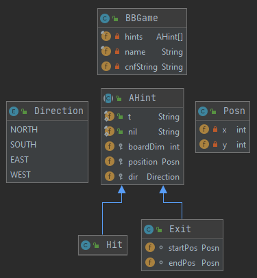

# BlackBoxSAT
Solving the consistency problem for the 70's board game BlackBox

## Overview of the game
Inspired by the invention of the CAT scanner, BlackBox is a puzzle game in which players try to locate balls, called "atoms" that have been hidden inside a square grid, the namesake "blackbox." Player can "shoot" rays of light from the border of the grid into the blackbox, which may hit atoms directly or deflect into a new path. In practice, players uncover hints along the border that each show the end behavior of a ray shot into the blackbox from that position. From these hints, players can deduce the locations of these atoms.  

A full overview of the rules can be found here: https://en.wikipedia.org/wiki/Black_Box_(game)

You can try out an online version of the game @ http://bibeault.ninja/blackbox/ 

## Our goal
We have written a program that represents Black Box hints as a SAT problems. Bundling several hints together allows us to determine their consistency (i.e. check for contradictions). For consistent boards, our algorithm can also recover a set of ball positions that satisfy each of the "hints."

## Dependencies
A dependency necessary for implementation is [LogicNG] (https://github.com/logic-ng/LogicNG). LogicNG is a library that allows for memory-efficient Boolean formula manipulation in Java. It provides a flexible tool for parsing complex boolean formulas into conjunctive normal form (CNF), as well as a Java implementation of MiniSAT.  

For property-based testing, we use a framework for JUnit called [Quick-Check] (https://pholser.github.io/junit-quickcheck/site/0.9.5/).

Both of these dependencies are part of the Maven Central Repository, and they should already be included in the project's pom.xml file. If, for whatever reason, it gives an error, manually replace the dependency list in your pom.xml copy with the following: 

```
<dependencies>
  <dependency>
    <groupId>org.logicng</groupId>
    <artifactId>logicng</artifactId>
    <version>2.0.2</version>
  </dependency>
  <dependency>
    <groupId>com.pholser</groupId>
    <artifactId>junit-quickcheck-core</artifactId>
    <version>0.9.5</version>
  </dependency>
  <dependency>
    <groupId>com.pholser</groupId>
    <artifactId>junit-quickcheck-generators</artifactId>
    <version>0.9.5</version>
  </dependency>
</dependencies>
```

## Getting Started

### Instantiating Hints
Hints can be instantiated as Hit or Exit objects, children of the AHint abstract class. All that is required for Boolean formula generation is an AHint object. Our board-indexing convention assumes that the top left corner of the blackbox is (0, 0), with x increasing when travelling east and y increasing when travelling south. 

```
AHint hit1 = new Hit(3, new Posn(-1, 2), Direction.EAST); 
AHint exit2 = new Exit(5, new Posn(3, -1), Direction.SOUTH, new Posn(3, -1));
AHint exit3 = new Exit(5, new Posn(5, 1), Direction.WEST, new Posn(3, -1)); 
```

- ```hit1``` represents a ray that will hit an atom during its travel. It starts outside the board at position  ```(-1, 2)```, initially travelling east on a board of side length 3. 
- ```exit2``` represents a ray on a board of side length 5 that starts at position ```(3, -1)```, travelling south. For ex2 to be satisfied, the ray must exit at position ```(3, -1)```. 
- ```exit3``` represents a ray on a board of side length 5 that starts at position ```(5, 1)```, travelling west. For ex3 to be satisfied, the ray must exit at position ```(3, -1)```, the same end position as ex2.

### Finding Board Consistency
Hints can be bundled into boards as shown: 

```
AHint[] set1 = {hit1, exit2, exit3};
AHint[] set2 = {exit2, exit3};

//BBGame board1 = new BBGame("Example 1", set1);
BBGame board2 = new BBGame("Example 2", set2);
```

Nothing will stop you from constructing ```set1``` and ```set2```. However, trying to instantiate ```board1``` will result in an error, since ```hit1``` operates on a differently sized board than the other hints in the array. ```board2``` will be constructed without error. From this, you can determine consistency by calling

```
board2.consistent()
```

You can include an optional boolean argument, set to ```false``` to allow the algorithm to recover the solution and display it in a plain-text board rendering. 

For more board examples, see the ```testBoards()``` method in the AHintTest.java file.  

